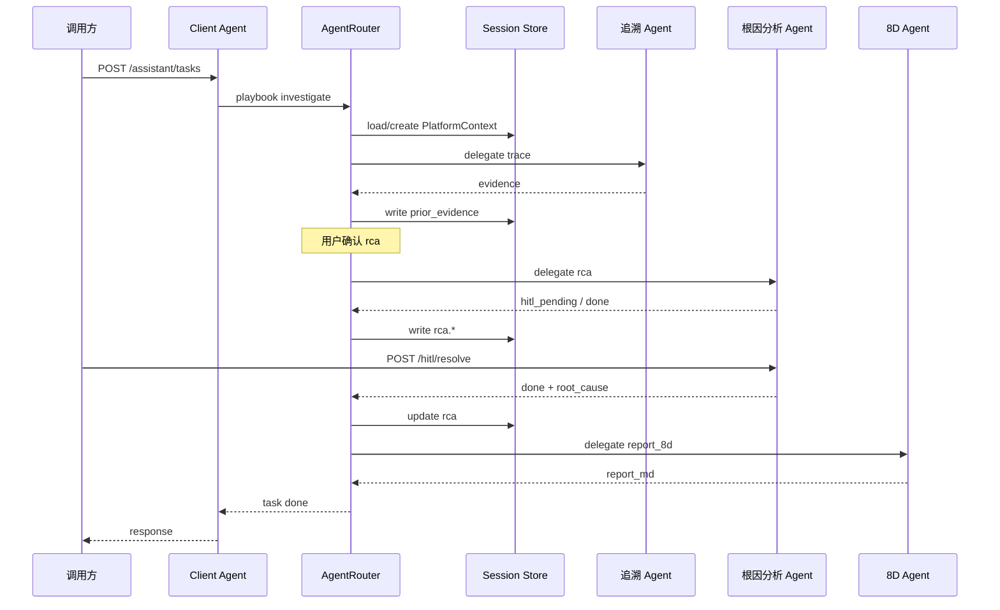

# 锂电智能制造智能分析平台 — 产品与技术规格

> 状态：Spec 草案 | 制造产线优先 | 关联实现：`Battery_Agent_DS`

---

## 1. 背景

### 1.1 行业与场景

- **行业**：锂电池制造（方壳 / 软包 / 圆柱）
- **工序范围**：匀浆 → 涂布 → 辊压 → 分切 → 卷绕/叠片 → 注液 → 化成分容 → 检测分选
- **切入域**：生产制造 **品质管理**（非售后为主，售后可作为扩展 Agent）

### 1.2 系统定位

| 层级 | 定位 |
|------|------|
| **对外产品名** | 锂电制造 **品质与工艺智能分析平台**（品质 Copilot） |
| **与 MES/QMS 关系** | **智能分析层**：读制造数据、辅助判定与报告；**不替代** MES 执行制造 |
| **演进路径** | 单能力 RCA Agent → 平台壳 + 多 Agent 可插拔 → 智造分析能力扩展 |

### 1.3 与现有项目关系

```
Battery_Agent_DS          = 根因分析 Agent 服务（已实现）
Battery_Agent_DS_Aug      = 平台 Spec / 演进设计（本目录）
未来：Client + Planner + AgentRouter 平台壳 + 多个 Agent 服务（RCA 为其中之一）
```

---

## 2. 痛点

### 2.1 核心业务痛点

| 痛点 | 表现 | 影响 |
|------|------|------|
| **数据孤岛** | MES / SCADA / ERP / LIMS 独立；人工跨系统切换 | 排查 4–8h/次 |
| **信息过载** | 时序、批次、检测数据量大 | 难抓故障特征 |
| **黑盒 AI 不可签收** | 纯 LLM/RAG 结论不可复现 | 质量经理不敢签字 |
| **知识断层** | 8D、FMEA 在 Excel/PDF；未回流系统 | 同类问题重复排查 |
| **责任与合规** | 低置信仍自动出结论 | 产线不敢用 |
| **角色需求分裂** | 巡检要摘要、工程师要 RCA、经理要审批 | 单一 Chat 体验差 |

### 2.2 为何不是「一个 Chatbot」

缺的不是对话，而是：

1. **跨系统取证**（MCP）
2. **可复现判定**（FMEA 规则引擎）
3. **有环补查 + HITL**
4. **多业务能力** 按场景选用（非万事皆 RCA）

---

## 3. 目标用户与场景

### 3.1 用户

| 角色 | 典型需求 | 主要能力 |
|------|----------|----------|
| **巡检** | 开班巡线、报警汇总 | 巡检 Agent（轻） |
| **班组长** | 分诊、派单、是否升级 | 分诊 + 追溯（中） |
| **质量工程师** | 深度根因、证据链、8D 草稿 | 追溯 → RCA → 8D |
| **质量经理** | 审批、对外发布、CAPA | HITL L2 签字 |

### 3.2 场景剧本（Playbook）

权威清单见 **[260630_剧本规范.md](./260630_剧本规范.md)**（6 剧本 + `task_type=rca` 快捷入口）。

| 剧本 ID | 步骤摘要 | 默认触发 |
|---------|----------|----------|
| `shift_patrol` | 巡检 → 分诊? | 开班 |
| `trace_only` | 追溯 | 查批次 |
| `investigate` | 分诊? → 追溯 →（确认）→ RCA | 深度分析 |
| `close_loop` | RCA → HITL → 8D → QMS | 根因确认后 |
| `coating_incident` | 预警 → 工艺 → Safety ∥ RCA → 8D | 涂布异常 |
| `pm_alert` | 设备健康 → 工艺 → Safety | 设备预警 |

**原则**：不默认自动跑满全链；RCA 需显式确认或 API 声明（白名单集成除外）。

---

## 4. 产品目标与非目标

### 4.1 目标

- 跨系统取证自动化；根因初判 **分钟～十几分钟级**（含 LLM 与 MCP）
- **可解释**：FMEA 命中链 + 置信度公式可复算
- **可审计**：trace_id 全链路；Tool 调用 RBAC
- **人机协同**：分级 HITL；经理签字门闩
- **平台可扩展**：Agent 按需注册/启用/下线

### 4.2 非目标（一期不做）

- 多模态视觉（二期作 Tool/独立 Agent）
- **自动下发工艺参数**（仅建议 + HITL）
- 替代 MES 排产执行
- Agent 自由协商定根因
- 对话式去中心 Multi-Agent 网状协作

---

## 5. 架构总览

### 5.1 分层

```
┌─────────────────────────────────────────────────────────────┐
│  门户 / Client Agent      POST /v1/assistant/tasks           │
├─────────────────────────────────────────────────────────────┤
│  Planner Agent            ReAct 拆步（可选）                   │
│  AgentRouter              寻址 + 剧本状态机 + tasks/delegate  │
│  Agent Registry           可插拔 Agent 注册表                 │
│  Session Store            PlatformContext（Redis/DB）         │
├─────────────────────────────────────────────────────────────┤
│  Agent 服务（独立部署）                                       │
│    分诊 | 追溯 | 根因分析(RCA) | 8D | 巡检 | 预警 | …        │
├─────────────────────────────────────────────────────────────┤
│  共享 Harness             权限 · 审计 · 记忆 · 韧性           │
│  MCP 层                   mes · scada · erp · lims · qms   │
├─────────────────────────────────────────────────────────────┤
│  知识层                   FMEA(Neo4j/CSV) · Golden Case       │
│  数据层                   业务库 · Redis · PG · Milvus        │
└─────────────────────────────────────────────────────────────┘
```

> **术语**：早期 Spec 中的 **Supervisor** = 本图的 **Client + Planner + AgentRouter** 组合，已弃用单独 Supervisor 组件名。

### 5.2 协作拓扑（星型）

- **业务 Agent 不直连业务 Agent**
- **仅 AgentRouter**（代表平台控制面）委派 Agent 服务（HTTP 或 A2A）
- **Session Store** 传递跨步骤上下文
- **MCP / FMEA** 为共享基础设施，非 Agent

### 5.3 根因分析 Agent 内部（已实现）

```
Planner(LLM) → Executor(Worker) → Reflector(FMEA+LLM兜底)
       ⇄ 补查循环
       → HITL → Reporter(LLM)
```

实现仓库：`Battery_Agent_DS` · `agent/graphs/quality_analysis.py`

---

## 6. Agent 协作规则

### 6.1 关系矩阵（业务）

| Agent A | Agent B | 业务关系 | 技术关系 |
|---------|---------|----------|----------|
| 分诊 | RCA | 提供 defect_type、紧急度 | Router 写 PlatformContext |
| 追溯 | RCA | 提供 prior_evidence | Router 传参；可跳过重复 MCP |
| RCA | 8D | 提供 root_cause、evidence | RCA 完成后 Router 调 8D |
| 巡检/预警 | RCA | 可建议升级 | 经 Router + 人确认 |
| 任意 | 任意 | — | **禁止直连** |

### 6.2 RCA 在平台中的位置

- **不是**全平台总控枢纽
- **是**品质域最重、壁垒最高的 Agent 服务
- 上游常见：分诊、追溯、预警
- 下游常见：8D、CAPA、知识沉淀

---

## 7. 控制面与调度（Client · Planner · Router）

> 原 §7「Supervisor」已拆分为三个 Agent 服务，职责如下。

### 7.1 职责分工

| 组件 | 职责 |
|------|------|
| **Client Agent** | 统一入口；`POST /v1/assistant/tasks`；SSE 推送任务状态 |
| **Planner Agent** | 复杂目标 ReAct 拆步；产出子任务列表交 Router |
| **AgentRouter** | Agent Registry 寻址；**Playbook 状态机**；`tasks/delegate` |

| Router 编排职责 | 说明 |
|----------------|------|
| 意图 / 剧本 | 规则 + `playbook` / `task_type`；见 [260630_剧本规范.md](./260630_剧本规范.md) |
| 状态机 | received → triaging → tracing → rca_running → hitl_wait → reporting → done |
| 聚合 | 对调用方返回 `task_status`、`session_id` |

**分层原则**：平台 Planner 拆 **跨 Agent** 任务；RCA **内部** Planner 拆单 Agent 取证步骤，互不替代。

### 7.2 调用协议

| 场景 | 协议 |
|------|------|
| 平台内同集团 | **HTTP/OpenAPI**（P0 推荐） |
| 跨厂/跨团队 | **A2A** + Agent Card |
| RCA 内部 | LangGraph state + Checkpointer（不跨服务） |

### 7.3 调度状态 vs Session

| 存储 | 范围 | 内容 |
|------|------|------|
| **Router 剧本状态机** | 平台工单 | current_step、task_status |
| **Session Store** | 跨 Agent | batch_id、defect_type、prior_evidence、rca.* |
| **RCA Checkpointer** | RCA 服务内 | QualityAnalysisState、HITL thread_id |

---

## 8. 数据流（典型：investigate 剧本）



---

## 9. 根因分析 Agent 规格（核心）

### 9.1 设计原则

> **LLM 读和说，判定收回确定性代码。**

| 节点 | 类型 | 职责 |
|------|------|------|
| Planner | Agent 节点 | NL → 取证计划（含 parallel） |
| Executor | Worker | MCP 调用；并行 gather |
| Reflector | 规则 + LLM 兜底 | FMEA 命中、置信度、补查策略 |
| HITL | 流程节点 | interrupt / resume |
| Reporter | Agent 节点 | 8D 草稿；**不改写根因** |

### 9.2 置信度与 HITL

**置信度（确定性，非 LLM）：**

```
confidence = evidence_strength × coverage
若命中链路 ≥ 2：× 0.85
默认 HITL 阈值：0.7
```

**分级 HITL：**

| 层级 | 角色 | 触发 |
|------|------|------|
| L1 | 质量工程师 | confidence < 0.7；DEGRADE |
| L2 | 质量经理 | 高严重度缺陷；对外 8D/停线/批次封存 |

经理签字 = f(置信度, 严重度, 影响范围, 是否对外发布)。

### 9.3 补查策略

| 模式 | 含义 |
|------|------|
| DEEPEN | 单链下钻 |
| CORRELATE | 多链横向关联 |
| REPLAN | 0 命中重规划 |
| DEGRADE | 知识盲区降级 → 常触发 HITL |
| CONFIRM | 可出结论 |

---

## 10. 知识治理（FMEA）

| 对象 | 主责 | 存储 |
|------|------|------|
| FMEA 因果树 | 工艺工程师 | **CSV/Excel 为 Source of Truth** |
| 运行时 | — | Neo4j 发布态镜像 |
| Golden Case | 质量工程师 | YAML / 图库 |
| ETL | IT | 审核后 import；响应带 `fmea_version` |

同步：**按发布**，非实时；禁止只改 Neo4j 不回流 CSV。

---

## 11. MCP 与数据域

| Server | 用途 | 阶段 |
|--------|------|------|
| mes | 批次、缺陷、工单 | P0 已有 |
| scada | 时序、设备 | P0 已有 |
| erp | 物料、配方（敏感） | P0 已有 |
| lims | 检测数据 | P0 已有 |
| qms | 8D、CAPA、客诉 | P1 规划 |

原则：**一数据源一 MCP Server**；各 Agent 共享 ToolRegistry，不为每 Agent 各建一套 MCP。

---

## 12. 能力路线图

### 12.1 品质域 Agent

| Agent | 优先级 | 状态 |
|-------|--------|------|
| 根因分析 RCA | P0 | **已实现**（Battery_Agent_DS） |
| 追溯 | P1 | 规划 |
| 分诊 | P0 | **已实现**（triage-agent，LLM+Rule双模） |
| 8D 报告 | P1 | 规划（可复用 Reporter） |
| 巡检 | P2 | 规划 |
| 预警 | P2 | 规划 |
| 知识 | P2 | 部分（Neo4j ETL） |

### 12.2 扩展域（可插拔）

| 方向 | 优先级 |
|------|--------|
| 售后/质保 | P3 |
| 设备 PdM | P3 |
| 视觉检测 | P3 |
| 工艺参数分析 | P3 |
| 排产辅助 | P3 |

### 12.3 平台壳

| 组件 | 优先级 |
|------|--------|
| Planner + Router + Registry + Session | P1 |
| 统一门户 UX | P0（完善整体底线） |
| MES/QMS 写回 | P0 |
| tenant_id / factory_id | P0 |
| 模型治理、成本配额 | P1 |
| A2A 对外 | P2 |

---

## 13. 完善整体之必不可缺项（P0 底线）

| 项 | 说明 |
|----|------|
| 门户 UX | HITL、证据链、任务状态 |
| MES/QMS 闭环 | 读 MCP + **写回** 8D/工单状态 |
| 安全与权限 | RBAC + 工控网边界 + 全操作审计 |
| 可观测与韧性 | trace_id、超时、重试、MCP 熔断、健康检查 |
| 多工厂数据隔离 | tenant_id / factory_id |

后置：等保取证、完整 OTel、边缘部署、全自动改工艺。

---

## 14. 不可替代性（为何此架构）

| 组合能力 | 替代方案短板 |
|----------|--------------|
| MCP 跨系统取证 | 纯 RAG 无实时产线数据 |
| LangGraph 有环 + 补查 | 单轮 Chat 无法「不够再查」 |
| FMEA 确定性置信度 | LLM 自评不可签收 |
| HITL + Checkpointer | 低置信不敢用于产线 |
| Planner + Router + 多 Agent | 万事皆 RCA 成本高、体验差 |
| 任务式 API/A2A | 纯 Chat 难嵌入 MES/QMS |

---

## 15. Workflow vs Multi-Agent（本 Spec 立场）

| 维度 | 本平台的选法 |
|------|--------------|
| RCA 内部 | **Workflow**（LangGraph） |
| 平台层 | **Router Playbook 状态机** 编排多个 **Agent 服务** |
| Agent 间协作 | **中心化星型**（经 AgentRouter），非 Agent 网状互连 |
| A2A | 传输层选项，**不**等于去中心智能涌现 |
| 专业制造场景 | 重编排 + 规则 + HITL，**非**多 LLM 互聊 |

---

## 16. 开放问题（待产品拍板）

1. 高严重度缺陷清单（析锂、内短路、批量容量衰减…）与 L2 签字矩阵
2. QMS 写回字段与状态机对接方式
3. 单厂先行 or 多 tenant 首版即做
4. 平台首期 HTTP OpenAPI only or 同步上 A2A（见 [A2A_PROTOCOL.md](./260630_A2A协议.md)）

---

## 附录 A：参考实现路径

| 组件 | 仓库/路径 |
|------|-----------|
| RCA Workflow | `services/a2a_server/rca-agent/agent/graphs/quality_analysis.py` |
| FMEA 验证器 | `services/a2a_server/rca-agent/harness/validation/fmea_validator.py` |
| API | `services/a2a_server/rca-agent/api/main.py` |
| MCP | `services/mcp/` |
| 部署 | `deploy/docker-compose.platform.yml` |
