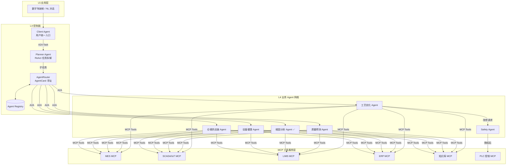
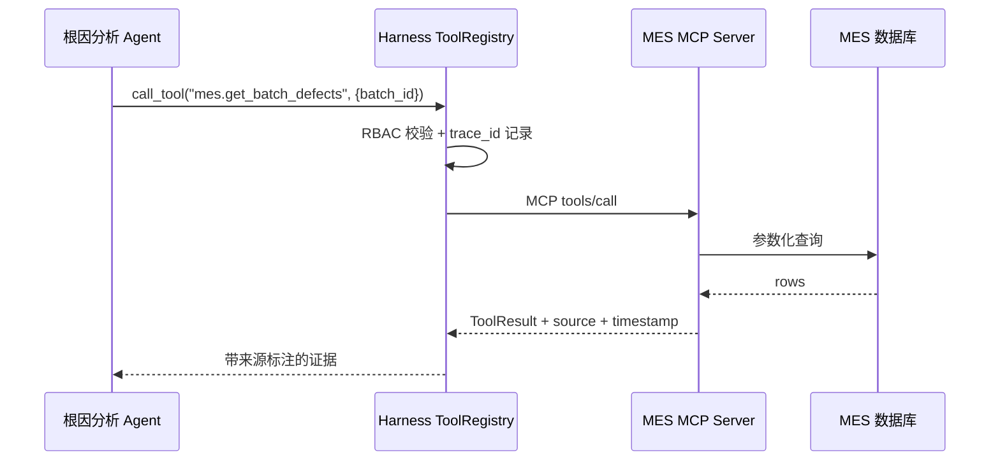
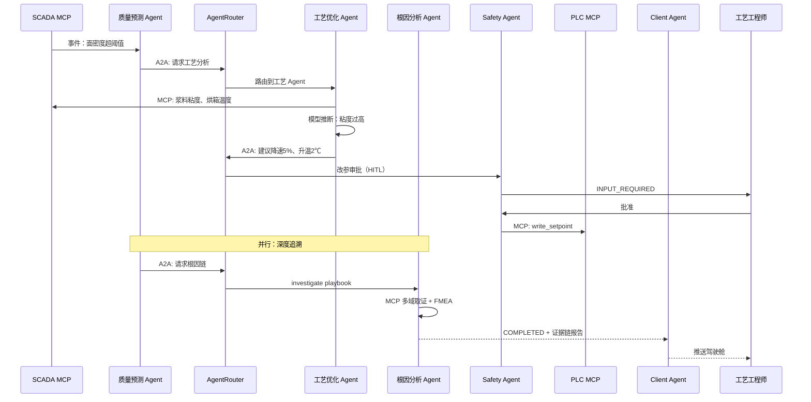

# 锂电生产智能化平台 — A2A + MCP 多智能体架构（2026）

> **版本**：v1.0 | 2026-06-23  
> **设计理念**：数据驱动 + AI 协同 + 全链贯通；**Agent Native** 架构，非传统分层堆砌  
> **关联实现**：`Battery_Agent_DS`（RCA Agent + MCP 四 Server + Harness）  
> **参考技术**：A2A Protocol · MCP · AgentCard · TaskState · ReAct Planning

---

## 1. 一句话定位

**锂电生产智能化平台**：以 **Planner + AgentRouter** 为大脑，**业务 Agent 网络** 通过 **A2A 协议** 协同执行，经 **MCP** 统一访问 MES/SCADA/ERP/LIMS/WMS 等制造系统；覆盖设备感知→数据集成→MOM 业务→智能决策→应用协同全链路，**不替代 MES 执行**，定位为制造运营的 **智能分析与协同层**。

---

## 2. 核心设计理念

| 原则 | 说明 | 对应技术 |
|------|------|----------|
| **去中心化协作** | 工艺 Agent 可直接经 Router 呼叫设备 Agent 协商参数，非单一中心大包大揽 | A2A + AgentRouter |
| **标准化能力暴露** | Agent 不直连数据库/PLC，统一经 MCP Tools 访问底层系统 | MCP Server |
| **动态任务编排** | Planner 将「提升良率」「追溯涂布异常」拆解为子任务并分发 | Planner Agent + ReAct |
| **可签收判定** | 关键结论由规则引擎/FMEA 确定性产出，LLM 负责读数与表达 | LangGraph + HITL |
| **制造安全门闩** | 停线、改参、对外 8D 等高危动作须经 Safety/HITL 审批 | Safety Agent + L2 签字 |

> **与纯 Chatbot 的区别**：缺的不是对话，而是 **跨系统取证（MCP）+ 可复现判定 + 有环补查 + 多业务能力按场景组合**。

---

## 3. 整体五层架构（自下而上）

```
┌───────────────────────────────────────────────────────────────────────┐
│  L5 · 应用与协同层（价值输出）                                          │
│  数字驾驶舱（厂长/工艺/质量/设备）│ 客户协同门户 │ 供应链协同 │ 电池护照   │
└───────────────────────────────────────────────────────────────────────┘
                                    ▲
┌───────────────────────────────────────────────────────────────────────┐
│  L4 · 智能决策与 Agent 层（大脑 + 执行网络）                             │
│  ┌─────────────────────────────────────────────────────────────────┐  │
│  │ Client Agent │ Planner Agent │ AgentRouter │ Agent Registry      │  │
│  └─────────────────────────────────────────────────────────────────┘  │
│  工艺优化│质量预测│根因分析✅│设备健康│能耗调度│仓储供应链│巡检│预警│8D  │
│                    ↕ A2A Protocol (HTTP/gRPC, JSON-RPC)                │
└───────────────────────────────────────────────────────────────────────┘
                                    ▲
┌───────────────────────────────────────────────────────────────────────┐
│  L3 · 业务系统层（MOM 核心）                                            │
│  MES │ QMS │ APS │ EAM │ WMS │ EMS │ LIMS │ ODS                        │
└───────────────────────────────────────────────────────────────────────┘
                                    ▲
┌───────────────────────────────────────────────────────────────────────┐
│  L2 · 数据与集成层（中枢神经）                                          │
│  统一数据湖 │ 主数据(MDM) │ API 网关 │ 边缘计算节点                      │
└───────────────────────────────────────────────────────────────────────┘
                                    ▲
┌───────────────────────────────────────────────────────────────────────┐
│  L1 · 设备与感知层（手脚感官）                                          │
│  IIoT(Modbus/OPC UA) │ 传感器 │ 机器视觉 │ AGV/RGV │ RFID/条码追溯      │
└───────────────────────────────────────────────────────────────────────┘

         ═══════════════════════════════════════════════════
         L4 Agent 层  ──MCP──►  MCP Server 层  ──►  L2/L3 系统与数据
         ═══════════════════════════════════════════════════
```

### 3.1 关键数据流

| 方向 | 内容 |
|------|------|
| L1 → L2 | 毫秒级采集 → 边缘预处理 → 入湖 |
| L2 ↔ L3 | MES 读设备状态；QMS 写检验结果；APS 读产能约束 |
| L3 → L4 | 训练/推理数据（注液偏差 vs 容量衰减等） |
| L4 → L3/L1 | 优化建议（卷绕张力 +0.2N、注液补偿 +5μL）**经 HITL** |
| L5 ← 全层 | OEE、良率、能耗、追溯完整率 KPI |

---

## 4. L4 智能体层详解（A2A + MCP 核心）

### 4.1 控制面：Client · Planner · Router



| 组件 | 职责 | 技术要点 |
|------|------|----------|
| **Client Agent** | 接收用户 NL/API 指令，转化为标准 A2A Task | SSE/WebSocket 推送任务状态 |
| **Planner Agent** | 复杂目标 → 子任务 DAG；ReAct 反思调整计划 | 例：「优化注液量」→ 查历史→分析温湿度→算参→验证 |
| **AgentRouter** | 维护 AgentCard 注册表；按 capabilities 寻址 | HTTP/gRPC + JSON-RPC 风格 A2A |
| **Agent Registry** | Agent 元数据、健康检查、版本、enabled 开关 | 对齐 [AGENT_CATALOG.md](./260630_Agent目录.md) |

### 4.2 业务 Agent 网络

| Agent | 职责 | MCP Tools 示例 | A2A 协作对象 | 状态 |
|-------|------|----------------|--------------|------|
| **工艺优化** | 涂布/卷绕/化成参数监控与建议 | `read_sensor_value`, `get_process_recipe` | 质量、设备、Safety | P2 规划 |
| **质量预测** | SPC + AOI/电测趋势预警 | `get_lab_result`, `get_defect_stats` | 工艺、RCA | P2 规划 |
| **根因分析 RCA** | 跨域取证、FMEA 判定、8D 草稿 | 全 MCP 域 | 质量、追溯、8D | **✅ 已落地** |
| **设备健康** | 振动/电流频谱预测性维护 | `get_equipment_telemetry`, `get_maintenance_log` | 排产、工艺 | P3 规划 |
| **仓储供应链** | WMS 物料 JIT 协调 | `get_inventory`, `get_material_batch` | 工艺、MES | P3 规划 |
| **异常分诊** | 缺陷分类、紧急度、派单 | `get_alarm_feed` | 追溯、RCA | P1 规划 |
| **批次追溯** | 人机料法环测正反向追溯 | `trace_batch`, `get_tool_history` | RCA | P1 规划 |
| **产线巡检** | 开班摘要、报警汇总 | `get_shift_summary` | 分诊 | P2 规划 |
| **8D 报告** | 根因确认后 CAPA 草稿 | `create_8d_draft` | RCA、QMS 写回 | P1 规划 |
| **Safety** | 停线/改参/对外发布门闩 | `emergency_stop`（独占权限） | 全部 Agent | P0 规划 |

### 4.3 AgentCard 规范（A2A 服务发现）

```json
{
  "name": "quality-rca-agent",
  "description": "锂电制造质量根因分析：跨 MES/SCADA/LIMS 取证，FMEA 规则判定，低置信 HITL",
  "url": "https://rca-svc.factory.local/a2a/v1",
  "version": "1.2.0",
  "capabilities": [
    "root_cause_analysis",
    "evidence_chain",
    "fmea_validation",
    "report_8d_draft"
  ],
  "skills": [
    {
      "id": "analyze_quality",
      "name": "质量异常根因分析",
      "input_schema": { "batch_id": "string", "defect_type": "string?" }
    }
  ],
  "auth": { "type": "bearer", "scopes": ["quality:read", "mes:read", "scada:read"] },
  "mcp_servers": ["mes", "scada", "erp", "lims", "knowledge"],
  "hitl_required_below": 0.7
}
```

Router 根据 `capabilities` / `skills` 匹配 Planner 子任务，返回目标 Agent `url`。

### 4.4 A2A 消息与 TaskState

**任务提交（Client/Planner → AgentRouter → Business Agent）**

```json
{
  "jsonrpc": "2.0",
  "method": "tasks/send",
  "params": {
    "id": "task-8f3a2b",
    "session_id": "sess-001",
    "trace_id": "tr-abc123",
    "message": {
      "role": "user",
      "parts": [{ "type": "text", "text": "分析昨晚涂布工序面密度异常" }]
    },
    "metadata": {
      "factory_id": "FD-01",
      "batch_id": "B20260623001",
      "playbook": "investigate"
    }
  }
}
```

**TaskState 生命周期**

```
SUBMITTED → RUNNING → INPUT_REQUIRED (HITL) → RUNNING → COMPLETED
                    ↘ FAILED / CANCELLED
```

| 状态 | 含义 | 锂电场景 |
|------|------|----------|
| `SUBMITTED` | 已入队 | 用户提交「追溯批次」 |
| `RUNNING` | Agent 执行中 | MCP 并行取证 |
| `INPUT_REQUIRED` | 需人工输入 | 置信度 <0.7，工程师确认 |
| `COMPLETED` | 完成 | 根因 + 证据链 + 报告 |
| `FAILED` | 失败 | MCP 熔断 / 超时 |

---

## 5. MCP 工具服务层

> **原则**：一数据源一 MCP Server；Agent **禁止**直连业务库；所有 Tool 调用经 Harness 统一 RBAC + 审计。

### 5.1 Server 目录

| MCP Server | Tools（示例） | 对接 L3 系统 | 阶段 |
|------------|---------------|--------------|------|
| **mes** | `get_work_order`, `get_batch_defects`, `update_work_order_note` | MES | ✅ P0 |
| **scada** | `read_sensor_value`, `get_timeseries`, `get_alarm_history` | SCADA/IoT | ✅ P0 |
| **erp** | `get_material_batch`, `get_bom`, `get_recipe` | ERP | ✅ P0 |
| **lims** | `get_lab_result`, `upload_quality_report` | LIMS | ✅ P0 |
| **qms** | `get_8d_record`, `create_capa` | QMS | P1 |
| **wms** | `get_inventory`, `get_inbound_status` | WMS | P2 |
| **eam** | `get_equipment_status`, `create_work_order` | EAM | P3 |
| **knowledge** | `search_sop`, `search_fmea`, `search_golden_case` | Milvus+Neo4j | ✅ 部分 |
| **plc** | `read_setpoint`, `write_setpoint` | PLC（**仅 Safety Agent**） | P3 + HITL |

### 5.2 MCP 调用链



实现参考：`Battery_Agent_DS/mcp_servers/` · `agent/tools/registry.py`

---

## 6. 典型业务场景：涂布面密度异常（A2A + MCP 全流程）



| 阶段 | 动作 | 协议 |
|------|------|------|
| **感知** | IoT MCP 监测面密度偏差 | MCP 事件订阅 |
| **诊断** | 质量 Agent A2A 呼叫工艺 Agent | A2A via Router |
| **决策** | 工艺 Agent MCP 取证 + 模型分析 | MCP + 内置算法 |
| **执行** | Safety Agent 审批后 PLC 改参 | A2A + MCP（门闩） |
| **追溯** | RCA Agent 跨域取证生成报告 | A2A + MCP + FMEA |

---

## 7. Planner Agent 推理循环（ReAct）

```
用户目标: "提升注液工序良率"
    │
    ▼
┌─ Thought: 需历史良率、环境、设备状态、当前参数 ─┐
│  Action:  Router → 追溯 Agent (batch scope)      │
│  Observation: 近7天良率 97.2%，湿度偏高天数 4/7   │
├─ Thought: 需工艺参数与 SPC ──────────────────────┤
│  Action:  Router → 工艺 Agent                     │
│  Observation: 注液量 CV 偏大，建议补偿 +3μL       │
├─ Thought: 需验证 FMEA 因果链 ────────────────────┤
│  Action:  Router → RCA Agent (prior_evidence)     │
│  Observation: 置信度 0.82，可出结论               │
├─ Thought: 改参需审批 ────────────────────────────┤
│  Action:  Router → Safety Agent → HITL            │
│  Observation: 工程师批准                          │
└─ Final:  TaskState COMPLETED，报告推送 Client ───┘
```

RCA Agent 内部仍为 **LangGraph Workflow**（Planner→Executor→Reflector→HITL→Reporter），与平台层 Planner **分层**：平台 Planner 拆 **跨 Agent** 任务；RCA 内 Planner 拆 **单 Agent 内** 取证步骤。

---

## 8. 记忆与上下文

| 层级 | 存储 | 范围 | 内容 |
|------|------|------|------|
| **Task Context** | Redis | 单次 A2A Task | batch_id、prior_evidence、中间结果 |
| **Session / PlatformContext** | Redis/PG | 跨 Agent 会话 | 见 [AGENT_CATALOG.md](./260630_Agent目录.md) |
| **Agent Memory** | Milvus + PG | 长期 | Golden Case、历史 8D、故障处理经验 |
| **Knowledge Graph** | Neo4j | 全局 | FMEA 因果树、工序-失效关系 |
| **RCA Checkpoint** | LangGraph Saver | RCA 服务内 | QualityAnalysisState、HITL thread |

---

## 9. 安全、合规与制造门闩

| 机制 | 说明 |
|------|------|
| **AgentCard scopes** | 各 Agent 仅能调用授权 MCP Tool |
| **Safety Agent 独占** | `emergency_stop`、`write_setpoint` 仅 Safety 可执行 |
| **分级 HITL** | L1 工程师（置信度 <0.7）；L2 经理（停线/对外 8D/批次封存） |
| **trace_id 全链路** | A2A 消息 + MCP Tool 调用统一审计 |
| **工控网边界** | MCP Server 部署在 DMZ；PLC 写操作二次确认 |
| **IATF 16949** | 证据链可复算；FMEA 版本可追溯 |

---

## 10. 技术栈映射

| 模块 | 技术实现 | 锂电业务价值 |
|------|----------|--------------|
| **A2A 通信** | HTTP/gRPC + JSON-RPC 风格消息 | 异构系统（西门子 PLC + 自研 AI）语义互通 |
| **MCP** | Model Context Protocol Tools/Resources | 统一 MES/WMS/SCADA 接口，Agent 开发不绑数据库驱动 |
| **AgentCard** | name, description, capabilities, skills | 明确职权（仅 Safety 可停机） |
| **TaskState** | SUBMITTED/RUNNING/INPUT_REQUIRED/COMPLETED | 长周期优化任务可追踪、可中断、可恢复 |
| **LangGraph** | RCA 内有环 Workflow + interrupt | 补查循环 + HITL 断点恢复 |
| **Harness** | RBAC · 审计 · 熔断 · 记忆 · Eval | 各 Agent 共享工业级底座 |

---

## 11. 与现有代码对齐

> 详细状态见 [IMPLEMENTATION_STATUS.md](./260630_实现状态.md)。

| 架构组件 | 实现状态 | 仓库路径 |
|----------|----------|----------|
| MCP mes/scada/erp/lims/qms | ✅ | `services/mcp/` |
| ToolRegistry RBAC/审计 | ✅ | `packages/harness-core/` |
| 根因分析 Agent（LangGraph） | ✅ | `services/a2a_server/rca-agent/`（姊妹仓） |
| Client Gateway | ✅ | `services/client-gateway/` |
| Playbook Orchestrator | ✅ | `services/orchestrator/` |
| Capability Registry | ✅ | `services/capability-registry/` |
| trace / report-8d Worker | ✅ | `services/a2a_server/trace_worker/` · `report-agent/` |
| A2A `mount_a2a` / AsyncA2AServer | ✅ | `packages/platform-contracts/` |
| AgentNetwork 动态寻址 | ✅ | `platform_contracts/agent_network.py` |
| Planner（平台级） | ⚠️ MVP | `services/planner-agent/` |
| Safety + plc MCP | ❌ | §9 |
| coating_incident / pm_alert 剧本 | ❌ | [260630_剧本规范.md](./260630_剧本规范.md) |

---

## 12. 分期落地路线

### Phase 0 — 已验证（当前）

- [x] MCP 四域 Server + ToolRegistry
- [x] 根因分析 Agent 全图 + FastAPI
- [x] FMEA + Golden Case 知识底座

### Phase 1 — 平台壳（3 个月）

- [ ] AgentRouter + AgentCard Registry（HTTP）
- [ ] Client Agent + 任务状态 API
- [ ] PlatformContext Redis SDK
- [ ] 追溯 Agent、分诊 Agent 轻量服务
- [ ] A2A TaskState 标准消息格式

### Phase 2 — 生产场景扩展（6 个月）

- [ ] 质量预测 Agent（SPC 事件 → A2A 触发 RCA）
- [ ] 工艺优化 Agent（只读建议 + HITL）
- [ ] QMS/WMS MCP Server
- [ ] 数字驾驶舱 MVP

### Phase 3 — 全厂智能（12 个月）

- [ ] 设备健康 Agent + EAM MCP
- [ ] Safety Agent + PLC MCP（严格门闩）
- [ ] 跨工厂 AgentCard 联邦
- [ ] 边缘节点本地推理

**切入建议**：先跑通 **质量预测 Agent → A2A → RCA Agent → MCP 取证** 单链路，再扩展工艺/设备 Agent。

---

## 13. 架构优势（汇报/招标用）

| 优势 | 说明 |
|------|------|
| **一体化** | L1–L5 统一架构，避免烟囱式系统 |
| **Agent Native** | 业务能力即 Agent，按需注册/启用/下线 |
| **解耦** | MCP 隔离 AI 与 IT/OT；模型升级不重构接口 |
| **群体智能** | Agent 经 A2A 协商，非死板单点 Chat |
| **可签收** | FMEA 确定性 + HITL，满足产线合规 |
| **可扩展** | 1GWh→100GWh 模块化扩容；圆柱/方壳/软包换型 |

---

## 14. 相关文档

| 文档 | 内容 |
|------|------|
| [PLATFORM_SPEC.md](./260630_平台产品规格.md) | 产品背景、痛点、分期（星型编排视角） |
| [AGENT_CATALOG.md](./260630_Agent目录.md) | Agent 注册表、API 契约、PlatformContext |
| [TERMINOLOGY.md](./260630_术语表.md) | Agent/Workflow/A2A 术语 |
| [IMPLEMENTATION_STATUS.md](./260630_实现状态.md) | 已实现 vs 规划对照 |
| [简历_锂电智能化平台.md](./260630_简历_锂电智能分析平台.md) | 投递用项目描述 |

---

## 附录 A：Draw.io / PPT 粘贴用 ASCII 总图

```
[厂长/工程师] → [Client Agent] → [Planner Agent] → [AgentRouter] → [Agent Registry]
                                              │
                    ┌─────────────────────────┼─────────────────────────┐
                    ▼                         ▼                         ▼
            [工艺优化 Agent]          [质量预测 Agent]          [根因分析 Agent✅]
            [设备健康 Agent]          [仓储 Agent]              [Safety Agent]
                    │                         │                         │
                    └─────────────────────────┼─────────────────────────┘
                                              ▼
                              [ Harness: RBAC · 审计 · 记忆 · 熔断 ]
                                              │
                    ┌─────────────────────────┼─────────────────────────┐
                    ▼                         ▼                         ▼
              [MES MCP]               [SCADA MCP]               [LIMS MCP] ...
                    │                         │                         │
                    ▼                         ▼                         ▼
              [ MES ]                   [ SCADA/IoT ]               [ LIMS ]
                    └─────────────────────────┴─────────────────────────┘
                                              │
                                    [ 数据湖 / 主数据 / 边缘 ]
                                              │
                                    [ 传感器 / PLC / 视觉 / AGV ]
```
