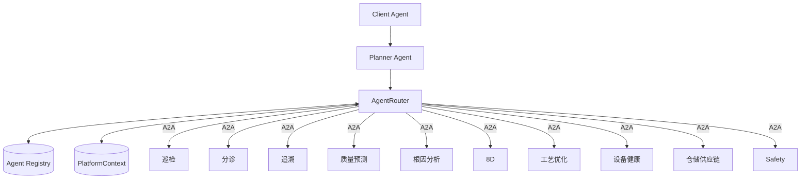

# Agent 能力目录与 PlatformContext

> 注意：本文档为早期设计稿，部分内容已过时。
> 最新架构请参考 [ARCHITECTURE_OVERVIEW.md](./ARCHITECTURE_OVERVIEW.md)。
> 实际运行的 AgentCard 定义见 `platform_contracts/agent_registry_seed.py`。

> 协作协议：**A2A**（经 Orchestrator）· 数据访问：**MCP** · AgentCard 见 `agent_registry_seed.py`

## 1. Agent 注册表（AgentCard）

### 1.1 控制面 Agent

```yaml
agents:
  - name: client-agent
    description: 用户统一入口，NL/驾驶舱指令转 A2A Task
    url: http://client-svc:8000/a2a/v1
    capabilities: [user_gateway, task_status_push]
    enabled: false  # P1 Spec；入口 API 见 §2 Client

  - name: planner-agent
    description: 复杂目标 ReAct 拆解，子任务委派 Router
    url: http://planner-svc:8010/a2a/v1
    capabilities: [task_planning, task_delegation]
    enabled: false  # P1

  - name: agent-router
    description: AgentCard 寻址与 A2A 消息路由
    url: http://router-svc:8020/a2a/v1
    capabilities: [routing, registry]
    enabled: false  # P1
```

### 1.2 业务 Agent 网络

```yaml
agents:
  - name: process-optimization-agent
    description: 涂布/卷绕/化成参数监控与优化建议
    url: http://process-svc:8202/a2a/v1
    capabilities: [process_optimization, parameter_recommendation]
    mcp_servers: [mes, scada, knowledge]
    enabled: false  # P2

  - name: quality-prediction-agent
    description: SPC+AOI/电测趋势预警，异常时 A2A 触发分析
    url: http://quality-pred-svc:8201/a2a/v1
    capabilities: [spc_alarm, defect_trend]
    mcp_servers: [mes, scada, lims]
    enabled: false  # P2

  - name: quality-rca-agent
    description: 跨域取证+FMEA根因判定+HITL+8D草稿
    url: http://rca-svc:8003/a2a/v1
    capabilities: [root_cause_analysis, evidence_chain, report_8d_draft]
    mcp_servers: [mes, scada, erp, lims, knowledge]
    implementation: Battery_Agent_DS
    hitl_required_below: 0.7
    enabled: true  # ✅ P0 已落地

  - name: equipment-health-agent
    description: 设备振动/电流频谱预测性维护
    url: http://eam-svc:8203/a2a/v1
    capabilities: [predictive_maintenance, equipment_telemetry]
    mcp_servers: [scada, eam]
    enabled: false  # P3

  - name: wms-supply-agent
    description: WMS 物料库存与 JIT 配送协调
    url: http://wms-svc:8204/a2a/v1
    capabilities: [inventory_query, material_trace]
    mcp_servers: [wms, erp]
    enabled: false  # P3

  - name: triage-agent
    description: 异常分诊、意图识别、多意图拆解（LLM + Rule 双模）
    url: http://triage-svc:8001/a2a/v1
    capabilities: [defect_classification, severity, intent_recognition]
    mcp_servers: [mes]
    enabled: true  # P0 已实现

  - name: trace-agent
    description: 批次正反向追溯，人机料法环测
    url: http://trace-svc:8002/a2a/v1
    capabilities: [batch_trace, process_params]
    mcp_servers: [mes, scada, erp, lims]
    enabled: false  # P1

  - name: report-8d-agent
    description: 根因确认后 8D/CAPA 报告生成
    url: http://report-svc:8004/a2a/v1
    capabilities: [report_8d]
    mcp_servers: [qms, knowledge]
    enabled: false  # P1

  - name: patrol-agent
    description: 开班巡线摘要、报警汇总
    url: http://patrol-svc:8005/a2a/v1
    capabilities: [patrol_summary]
    mcp_servers: [mes, scada]
    enabled: false  # P2

  - name: safety-agent
    description: 停线/改参/对外发布门闩（独占高危 Tool）
    url: http://safety-svc:8099/a2a/v1
    capabilities: [emergency_stop, parameter_write_approval]
    mcp_servers: [plc, mes, qms]
    enabled: false  # P0 规划
```

## 2. API 契约（最小集）

### Client Agent（平台入口）

> 原「Supervisor」API 由 **Client Agent** 承载；编排由 Planner + AgentRouter 完成。

```
POST /v1/assistant/tasks
  body: { session_id?, message, task_type?, playbook?, factory_id, batch_id? }
  response: { session_id, task_id, status, steps[], result? }

GET  /v1/assistant/tasks/{task_id}
```

### 分诊 Agent

```
POST /v1/triage
  body: { session_id, query, batch_id? }
  response: { defect_type, severity, suggest_next: trace|rca|none }
```

### 追溯 Agent

```
POST /v1/trace
  body: { session_id, batch_id, query?, scopes? }
  response: { tool_calls, evidence, summary }
```

### 根因分析 Agent（已有）

```
POST /v1/analysis/quality
  body: { session_id, user_query, defect_type?, prior_tool_calls?, prior_evidence? }
  response: { thread_id, status, root_cause?, confidence?, requires_hitl?, report_md? }

POST /v1/hitl/resolve
  body: { thread_id, feedback }
```

### 8D 报告 Agent

```
POST /v1/report/8d
  body: { session_id, root_cause, evidence, hitl_approved: true }
  response: { report_md, recommendations }
```

## 2.1 AgentCard：mcp_servers 与 allowed_tools

每个业务 Agent 在 AgentCard 中声明两层约束（见 `packages/platform-contracts/mcp_tool_matrix.py`）：

| 字段 | 含义 |
|------|------|
| `mcp_servers` | 进程启动时连接的 MCP Server 列表 |
| `allowed_tools` | bootstrap **白名单**；Planner 只能看到此列表内的 Tool |

**质量域示例（你负责）**：

| Agent | mcp_servers | allowed_tools |
|-------|-------------|---------------|
| quality-rca-agent | mes, scada, erp, lims, knowledge | 11 个（四域全量 + knowledge） |
| trace-agent | mes, scada, erp, lims | 5 个取证子集 |
| triage-agent | mes | 2 个 |
| report-8d-agent | qms, knowledge | 3 个（P1） |

完整矩阵：**[mcp_tool_matrix.py](../packages/platform-contracts/src/platform_contracts/mcp_tool_matrix.py)** · 架构图见 [ARCHITECTURE_OVERVIEW.md](./ARCHITECTURE_OVERVIEW.md)。

## 3. PlatformContext 字段读写矩阵

| 字段 | 写入方 | 读取方 | 说明 |
|------|--------|--------|------|
| `session_id` | Client / Router | 全部 | 会话主键 |
| `trace_id` | Client / Router | 全部 | 审计链 |
| `tenant_id` / `factory_id` | Client / Router | 全部 | 多工厂隔离 |
| `batch_id` / `line_id` | 调用方 / Router | 追溯、RCA | 制造主键 |
| `defect_type` | 分诊 / 调用方 | RCA | 预填 FMEA 树 |
| `severity` | 分诊 | Router、HITL 策略 | 经理签字门闩 |
| `triage_result` | 分诊 | Router | suggest_next |
| `prior_tool_calls` | 追溯 | RCA | 减少重复取证 |
| `prior_evidence` | 追溯 | RCA | 证据前置 |
| `rca.thread_id` | RCA | RCA HITL、Router | LangGraph checkpoint |
| `rca.status` | RCA | Router、8D | pending/hitl/done |
| `rca.root_cause` | RCA | 8D、QMS 写回 | 定稿根因 |
| `rca.confidence` | RCA | Router、HITL UI | 确定性分数 |
| `rca.evidence` | RCA | 8D | 证据链 |
| `report_8d.report_md` | 8D | 门户、QMS | 报告草稿 |
| `task_status` | Router | 调用方 | 工单状态 |
| `fmea_version` | RCA | 审计 | 知识版本 |

## 4. 协作图（A2A + Router）

> **星型规则**：业务 Agent 通过 Orchestrator 编排；剧本定义见 [ARCHITECTURE_OVERVIEW.md](./ARCHITECTURE_OVERVIEW.md)。



> **制造门闩**：`write_setpoint` / `emergency_stop` 仅 **Safety Agent** 可调用 PLC MCP。  
> **8D 分工**：RCA Reporter 出草稿；**report-8d-agent** 定稿写 QMS（见 PLAYBOOK §3.5）。

## 5. 剧本与 Agent 调用序

权威定义见 **[playbooks.yaml](../config/playbooks.yaml)**（6 剧本 + `task_type=rca` 快捷入口）。

| playbook | 调用序列（逻辑） | 确认点 |
|----------|------------------|--------|
| `shift_patrol` | patrol → triage? | triage 可选 |
| `trace_only` | trace | 无 |
| `investigate` | triage? → trace → rca | trace→rca 前确认 |
| `close_loop` | rca → hitl → report_8d | 8D 前 rca done + 审批 |
| `coating_incident` | 预警 → 工艺 → safety ∥ rca → 8d | Safety HITL |
| `pm_alert` | 设备健康 → 工艺 → safety | Safety 门闩 |
