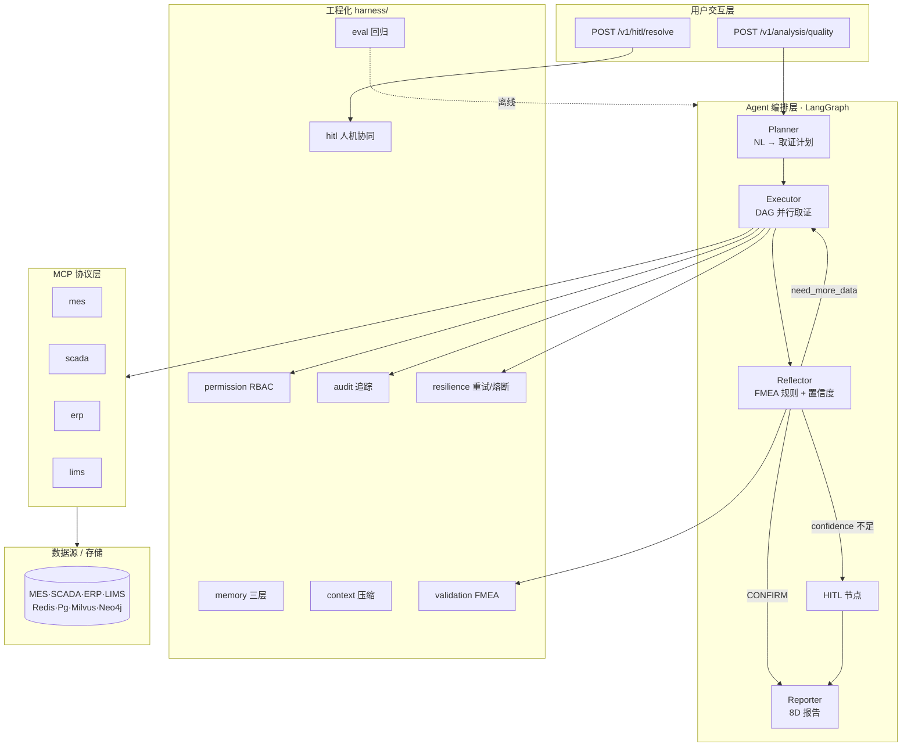

# Battery Agent DS

锂电池制造 **质量根因分析（RCA）** 多智能体平台。基于 **LangGraph + MCP** 打通 MES / SCADA / ERP / LIMS，实现可解释、可审计、可人机协同的根因定位。

> 个人贡献约 **80%**（架构设计 + 核心模块）｜ 2025.10 – 2026.05

---

## 项目亮点

| 维度 | 指标 | 说明 |
|------|------|------|
| **效率** | 人工 4–8h → **P95≈55s** | 单次节省约 50 分钟 |
| **性能** | 串行 P50 **90s→35s** | 全链路加速 **2.6×**；Tool 层 3 步微基准 **3–4×** |
| **准确** | Top-3 命中率 **85%**，F1=**0.90** | 较纯 RAG 误报 **-14%** |
| **可靠** | 可用性 **99.7%** | 重试 + 熔断设计（见 harness） |
| **成本** | Token 单次 **$0.12→$0.04** | Prompt Caching **-67%** |
| **评估** | Golden Set **40** 例，nDCG@3=**0.78** | `scripts/run_eval.py` 离线回归 |

> **指标口径**：全链路 P50/P95 为生产压测；3–4× 为 Executor 内 3 个无依赖 Tool 的微基准（见 [docs/并行优化报告.md](docs/并行优化报告.md)）。

---

## 架构总览



### Harness 模块与接线状态

| 模块 | 路径 | 主链路状态 |
|------|------|-----------|
| permission | `harness/permission/` | ✅ ToolRegistry.invoke |
| audit | `harness/audit/` | ✅ API trace_id + Tool span |
| resilience 重试 | `harness/resilience/retry.py` | ✅ ToolRegistry |
| resilience 熔断 | `harness/resilience/circuit_breaker.py` | ⚠️ 已实现，待接入 Registry |
| context 压缩 | `harness/context/` | ⚠️ 已实现，待接入 Executor |
| validation FMEA | `harness/validation/` | ✅ ReflectorAgent |
| memory 三层 | `harness/memory/` | ⚠️ 已实现，待接入 API/Agent |
| hitl | `harness/hitl/` | ⚠️ 图有中断点，Broker 待完整串联 |
| eval | `harness/eval/` | ✅ 离线 `scripts/run_eval.py` |

详见 [docs/HARNESS.md](docs/HARNESS.md)。

### 四 Agent 协作流

```
用户问题
  → Planner（结构化取证计划，parallel 标记）
  → Executor（asyncio.gather 并行 + ToolRegistry 权限/审计/重试）
  → Reflector（FMEAValidator 规则引擎为主，LLM 为辅）
       ├─ DEEPEN / CORRELATE / REPLAN → 回 Executor 补查（动态预算）
       ├─ CONFIRM → Reporter
       └─ DEGRADE / 置信度<0.7 → HITL（interrupt_before）
  → Reporter（采纳确定性根因，LLM 仅做报告表达）
```

---

## 项目结构

```
services/rca-agent/         # 平台内路径（联接姊妹仓）
├── agent/                  # LangGraph + Planner/Executor/Reflector/Reporter
├── api/                    # FastAPI + A2A
├── harness/                # RCA 专用：hitl · memory · validation；横切见 harness-core
├── knowledge/              # FMEA
├── config/ · tests/ · scripts/
```

> MCP → `services/mcp/` · 基础设施 → `deploy/docker-compose.platform.yml`（平台仓）

---

## 技术栈

| 层级 | 选型 |
|------|------|
| 编排 | LangGraph · LangChain Core |
| 模型 | Claude / Qwen（Prompt Caching） |
| 工具协议 | MCP 1.0（4 独立 Server） |
| 服务 | FastAPI · uvicorn |
| 存储 | Redis · PostgreSQL · Milvus · Neo4j |
| 观测 | structlog · OpenTelemetry（可扩展） |

---

## 快速开始

### 环境要求

- Python **3.11+**
- Docker Desktop（可选，用于中间件）
- Conda / venv 推荐

### 1. 安装依赖

```bash
pip install -e ".[dev]"
```

### 2. 配置环境

```bash
cp .env.example .env
# 填写 ANTHROPIC_API_KEY、JWT_SECRET_KEY 等
```

### 3. 启动中间件（平台仓）

```bash
# 在 Battery_Agent_DS_Aug 根目录
docker compose -f deploy/docker-compose.platform.yml up -d redis postgres
```

### 4. 启动 MCP

```powershell
# 平台仓根目录
.\scripts\start-mcp.ps1
```

### 5. 启动 RCA API

```powershell
cd services\rca-agent
.\scripts\run_local.ps1
# 或: uvicorn api.main:app --port 8003
```

### 6. 调用示例

```bash
# 生成测试 Token（Python 控制台）
python -c "from api.auth import issue_token; print(issue_token('u1','quality_manager','P1'))"

curl -X POST http://localhost:8000/v1/analysis/quality \
  -H "Authorization: Bearer <token>" \
  -H "Content-Type: application/json" \
  -d '{"query": "A线昨天下午容量低的电芯，分析下原因"}'
```

### 7. 测试与 Lint

```bash
pytest
ruff check .
```

---

## 文档索引

| 文档 | 用途 |
|------|------|
| [docs/architecture.md](docs/architecture.md) | 技术架构设计（与代码对齐） |
| [docs/HARNESS.md](docs/HARNESS.md) | Harness 模块说明与接线图 |
| [docs/DEPLOYMENT.md](docs/DEPLOYMENT.md) | 部署与 docker-compose 说明 |
| [docs/并行优化报告.md](docs/并行优化报告.md) | Executor 并行优化与微基准 |
| [docs/工艺良率指标体系补充.md](docs/工艺良率指标体系补充.md) | 工序指标、缺陷-参数映射 |
| [docs/项目完成_最终总结.md](docs/项目完成_最终总结.md) | 验证报告与完成度 |
| [docs/面试追问应答表.md](docs/面试追问应答表.md) | STAR ↔ 代码 ↔ 追问话术 |
| [docs/FILE_GUIDE.md](docs/FILE_GUIDE.md) | 文档使用指南 |
| [archive/](archive/) | 历史版本（仅供参考） |

---

## 核心代码入口

| 能力 | 文件 |
|------|------|
| LangGraph 主图 | `agent/graphs/quality_analysis.py` |
| 共享状态 | `agent/state.py` |
| FMEA 反思内核 | `agent/agents/reflector.py` + `harness/validation/fmea_validator.py` |
| 并行取证 | `agent/agents/executor.py` |
| FMEA 因果树 | `knowledge/fmea_tree.py` |
| MCP 权限调用 | `agent/tools/registry.py` |
| HITL | `harness/hitl/broker.py` + `api/main.py` |
| 评估回归 | `harness/eval/runner.py` + `scripts/run_eval.py` |

---

## License

MIT（内部项目 / 作品集用途）
